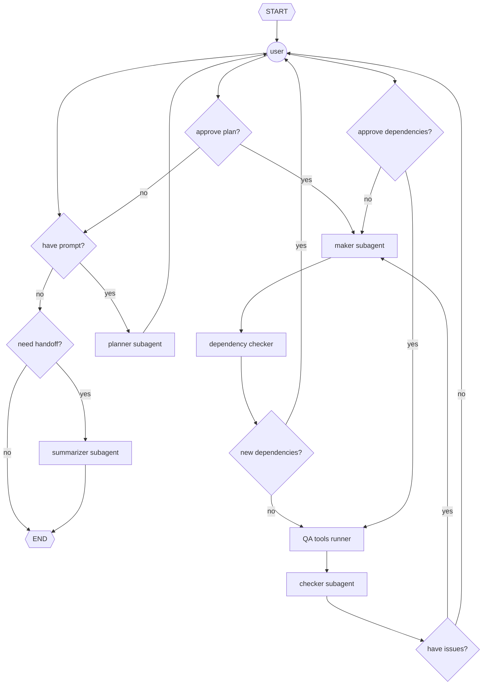

# Tern

Not an intern or an extern, just a tern: a provider-agnostic, flexible, multi-agent coding assistance system. Also a seabird. Primarily used a an exercise in building AI agents.

## Features

- Security
    - Agent runs in a microVM isolated from host (i.e., Docker Sandbox)
    - Agent's filesystem access is limited to the project directory in which it is installed
    - Agent's internet access is limited to a customizable allowlist
    - microVM proxy supports credential injection
    - Agent has deterministic human-in-the-loop (HITL) controls for dependency use approval
- Customizability
    - Subagent models and profiles are customizable through Docker Sandbox Kits

## Requirements

- [Docker Sandbox](https://www.docker.com/products/docker-sandboxes/) >= 0.28

## Download and Installation

TODO

## Usage

```bash
sbx login
uv run tern
```
TODO

## Agent Architecture



## Contributing

### Additional Requirements
- [uv](https://docs.astral.sh/uv/) >= 0.11

### Installation
```bash
$ uv python install 3.14 # if necessary
$ uv sync
$ uv run pre-commit autoupdate
$ uv run pre-commit install
```

### Guidelines
- Write self-documenting code
- Manage dependencies with `uv` (e.g., `uv add polars`)
- Verify types with `ty` (e.g., `uv run ty check`)
- Use `pytest` for tests (e.g., `uv run pytest`)
- Ensure style compliance with `ruff` (e.g., `uv run ruff check --fix`, `uv run ruff format`)
- Containerize releases with Docker
- Submit pull requests to `dev`
