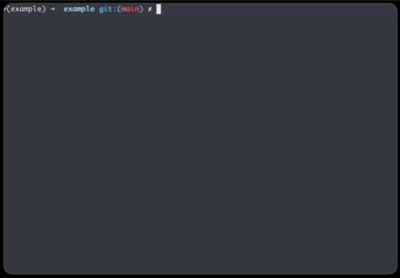
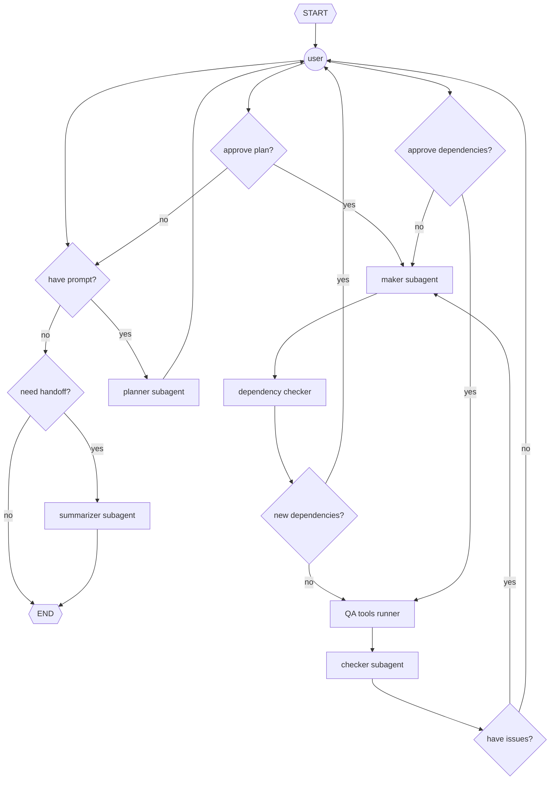

# Tern

Not an intern or an extern, just a tern: a provider-agnostic, human-in-the-loop, multi-agent coding assistant with deterministic security controls and user-configurable tool permissions, guardrails, subagent model choice, and prompt templates. Also a seabird. Primarily used as an exercise in building AI agents.



## Features

__Secure__
  - Agent runs in a microVM isolated from host (i.e., Docker Sandbox)
  - Agent's filesystem access is limited to the project directory in which it is installed
  - Agent's internet access is limited to a customizable allowlist
  - API credentials are supplied explicitly through Docker Sandbox secrets with nothing exposed to the sandbox internals.
  - Agent has deterministic human-in-the-loop (HITL) controls for dependency use approval

__Customizable__
  - Choose subagent models based on your risk level, task complexity, and cost (e.g., use open source model for Summarizer subagent, GPT for Maker subagent, and Claude for Checker subagent)
  - Customize your subagent personas and outputs
  - Define your own guardrails
  - Limit or expand your allowlist of domains
  - Incorporate your preferred QA tools to run deterministically after every build loop
  - Adjust subagent ReAct and adversarial loops limits based on your use cases and risk tolerances

__Lightweight__
  - Add it to your project as a development dependency
  - Turn on only when needed
  - Built with minimal dependencies and overhead

__Supported Model Providers__
  - Anthropic
  - Ollama (Pending)
  - OpenAI

__Supported Languages__
  - Python

## Requirements

- [Docker Sandbox (sbx)](https://www.docker.com/products/docker-sandboxes/) >= 0.28, <= 0.30
- [uv](https://docs.astral.sh/uv/) >= 0.11

## Download and Installation

```bash
uv add --dev "tern @ git+https://github.com/keiferc/tern.git"
```

## Usage

### Quickstart

```bash
uv run tern up
echo $ANTHROPIC_API_KEY | sbx secret set tern-<PROJECT_DIR> anthropic
uv run tern on
```

### Full Usage

```bash
usage: tern [-h] {up,on,down} ...

Provider-agnostic multi-agent coding assistant

positional arguments:
  {up,on,down}
    up          Initialize scaffold and/or sandbox
    on          Connect to sandbox and start REPL
    down        Remove scaffold and/or sandbox

options:
  -h, --help    show this help message and exit

subcommand flags:
  up    --scaffold   initialize .tern/ scaffold only
        --sandbox    initialize sandbox only
  down  --scaffold   remove .tern/ scaffold only
        --sandbox    remove sandbox only
```

### Customization

```bash
.tern
├── checker.md # Checker subagent template
├── config.yaml # Customizable parameters e.g., subagent models, loop limits
├── CONSTITUTION.md # Rules that apply to all subagents
├── maker.md # Maker subagent template
├── planner.md # Planner subagent template
├── spec.yaml # Docker Kit for customizing sandbox
└── summarizer.md # Summarizer subagent template
```

### Store API keys (once per project)
Tern uses explicit API keys stored as Docker Sandbox secrets. OAuth-backed sbx
provider credentials are not supported for Tern's custom sandbox kit.
See [`sbx secret` docs](https://docs.docker.com/reference/cli/sbx/secret/) for more info.

```bash
# Assuming you saved the API key as an environmental variable...
echo $ANTRHOPIC_API_KEY | sbx secret set tern-<PROJECT_DIR> anthropic # for Anthropic models
echo $OPENAI_API_KEY | sbx secret set tern-<PROJECT_DIR> openai # for OpenAI models
```

## Agent Architecture



## Contributing

### Installation
```bash
$ uv python install 3.14 # if necessary
$ uv sync
$ uv run pre-commit autoupdate
$ uv run pre-commit install
```

### Guidelines
- Write self-documenting code
- Manage dependencies with `uv` (e.g., `uv add polars`)
- Verify types with `ty` (e.g., `uv run ty check`)
- Use `pytest` for tests (e.g., `uv run pytest`)
- Ensure style compliance with `ruff` (e.g., `uv run ruff check --fix`, `uv run ruff format`)
- Containerize releases with Docker
- Submit pull requests to `dev`

### Backlog
- I/O performance optimization through concurrency and rate limiting
- Open source model support with Ollama
- AIOps and observability
- User commands (e.g., token usage status, ReAct loop interruption)
- Knowledge graph representation of codebase
- Modes (e.g., build mode, debugging mode, research mode, refactor mode)
